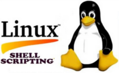
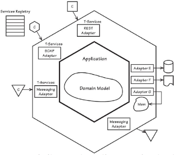

# ERP Rust ACME Corp (erp-rust-acme-corp)
Projeto prova de conceito (POC) para aplicar os conceitos, padrões de projetos e boas práticas para projetos usando a linguagem Rust.

O intuito é utilizar os recursos ociosos, tais como máquinas que estejam em ociosas transformando-as em um nó em um cluster e utilizar o poder de processamento em processamentos distribuídos. 

No contexto: A pouco tempo a empresa Acme Corporation após muita deliberação decide investir e implementar um ERP para uma ampla reoranização e automatização dos processos internos. Com o intuito de integrar os dados e ganhar competitividade no seu mercado de atuação online tenham sucesso a Acme necessita de um novo serviço web que disponibilize funcionalidades com base nas especificações do um EPR.

## Objetivos Principais:
- Criar uma sistema usando linguagem Rust API [rust-lang](https://www.rust-lang.org/);
- Criar um sistema web e Restful API disponíveis no Rust;
- Projetar Sistemas usando Arquiterura Microservices;
- Implantação Contínua - CI (Continuous Deployment) / Entrega Contínua - CD (Continuous Delivery); 

### Aplicar Habilidades e Proficiências

1 - Experiência em implementar usando a Rust linguagem [rust-lang](https://www.rust-lang.org/);

2 - Experiência em sistemas de banco de dados NoSQL (Cassandra, [MongoDB](https://www.mongodb.com/), etc.);
    

3 - Experiência em sistemas de containerização (e.g. [Docker](https://hub.docker.com/r/pss1suporte/paas-docker/));
    

4 - Experiência em sistemas Linux e shell scripting;
    

5 - Experiência em projetos utilizando micro serviços (Microservices) e computação distribuída;

### Como usar:

Considerando que o seu ambinete SDK já esteja preparado.

1. Clonar: `git clone https://github.com/pssilva/erp-rust-acme-corp.git`;
2. Acessar: `cd erp-rust-acme-corp`;
3. Construir o projeto: `cargo build`;
4. Executar a aplicação: `cargo run` ou `./target/debug/erp_rust_acme_corp`;

### UI Temas 
O projeto será adaptado para os seguintes temas (themes):

>[TRABALHO EM PROGRESSO]

### Todo List

Tomando como base: 

 1. Organização do código (usando o que se aplica e orientado sobre os módulos no [Capítulo 7](https://doc.rust-lang.org/stable/book/ch07-00-managing-growing-projects-with-packages-crates-and-modules.html))
 2. Usando vetores e strings (coleções, [Capítulo 8](https://doc.rust-lang.org/stable/book/ch08-00-common-collections.html))
 3. Tratamento de Erros ([Capítulo 9](https://doc.rust-lang.org/stable/book/ch09-00-error-handling.html))
 4. Usando características e tempos de vida quando apropriado ([Capítulo 10](https://doc.rust-lang.org/stable/book/ch10-00-generics.html))
 5. Escrever Testes ([Capítulo 11](https://doc.rust-lang.org/stable/book/ch11-00-testing.html))
 5. Organização do código usando Espaço de Trabalho ([Capítulo 14 :: Cargo Workspaces](https://doc.rust-lang.org/stable/book/ch14-03-cargo-workspaces.html))
 6. Estender o Cargo para comandos personalizados
 7. Analisar estilos de codificação e boas práticas dos códigos de bibliotécas disponíveis no [CRATES.IO](https://crates.io/)
 8. Enviar E-mails;
 9. Autenticação OAuth2;
 10. Implementar RESTful APIs;
 11. Automatizar geração de CRUDs;
 12. Integração com Logstash;
 13. Gerenciar Logstash com Elasticsearch;

## ERP - Enterprise Resource Planning (ERP)

Para manter o foco veja mais detalhes veja em [Sistemas ERP](doc-repo/ERP/README.md) tomando como base nas especificações gerais: [Projeto T2Ti ERP 3.0](http://t2ti.com/erp3/pdf/) 

---
### Referência

\[<b>Kristina Chodorow: 2013</b>\], O’Reilly Media, Inc. [MongoDB: The Definitive Guide](http://shop.oreilly.com/product/0636920028031.do): Second Edition  
\[<b>Shantanu Tushar, Sarath Lakshman: 2015</b>\], Wiley Authenticity Guarantee. [Linux Command Line and Shell Scripting Bible](http://www.wiley.com/WileyCDA/WileyTitle/productCd-111898384X.html): 3rd Edition  - The Comprehensive, Tutorial Resource 
\[<b>Richard Blum, Christine Bresnahan: 2013</b>\], Packt Publishing Ltd. [Linux Shell Scripting Cookbook](https://www.packtpub.com/networking-and-servers/linux-shell-scripting-cookbook-second-edition): Over 110 practical recipes to solve real-world shell problems, guaranteed to make you wonder how you ever lived without them  
\[<b>Vaughn Vernon: 2013</b>\], Addison-Wesley Professional; Edição: 1,[Implementing Domain-Driven Design](https://www.amazon.com.br/Implementing-Domain-Driven-Design-Vaughn-Vernon/dp/0321834577): Designing Fine-Grained Systems  
\[<b>Sam Newman: 2015</b>\], O’Reilly Media, Inc., [Building Microservices](http://shop.oreilly.com/product/0636920033158.do): Designing Fine-Grained Systems  
\[<b>THE RUST PROGRAMMING LANGUAGE: 2019</b>\], KLABNIK, Steve; NICHOLS, Carol, [THE RUST PROGRAMMING LANGUAGE](https://nostarch.com/Rust2018): by Steve Klabnik and Carol Nichols, with contributions from the Rust Community. Ed. 2019. Copyright © 2019 by Mozilla Corporation and the Rust Project Developers. San Francisco, 559 p. Disponível em: \<https://nostarch.com/Rust2018\>. Repositório em: \<https://github.com/rust-lang/book/\>. Documentação em: \<https://doc.rust-lang.org/stable/book/title-page.html\>. Acesso em: 08 Dec.2022. 
