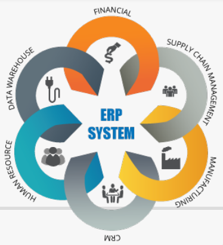

## Enterprise Resource Planning (ERP) :: E-Business

Para manter o foco veja mais detalhes em: [Projeto T2Ti ERP 3.0](http://t2ti.com/erp3/pdf/) 

### Especificação do Módulo: E-Business

[`TRABALHO EM PROGRESSO`]

---
### Referência

\[<b>THE RUST PROGRAMMING LANGUAGE: 2019</b>\], KLABNIK, Steve; NICHOLS, Carol, [THE RUST PROGRAMMING LANGUAGE](https://nostarch.com/Rust2018): by Steve Klabnik and Carol Nichols, with contributions from the Rust Community. Ed. 2019. Copyright © 2019 by Mozilla Corporation and the Rust Project Developers. San Francisco, 559 p. Disponível em: \<https://nostarch.com/Rust2018\>. Repositório em: \<https://github.com/rust-lang/book/\>. Documentação em: \<https://doc.rust-lang.org/stable/book/title-page.html\>. Acesso em: 08 Dec.2022. 